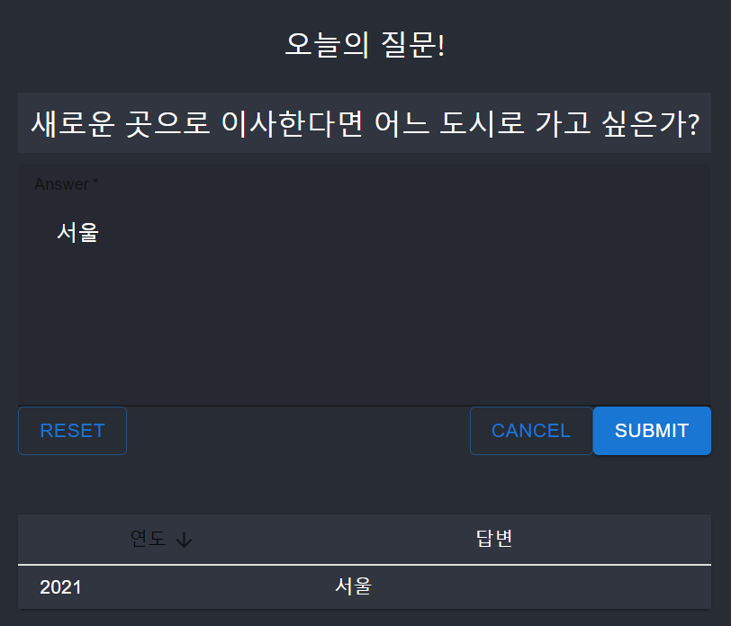
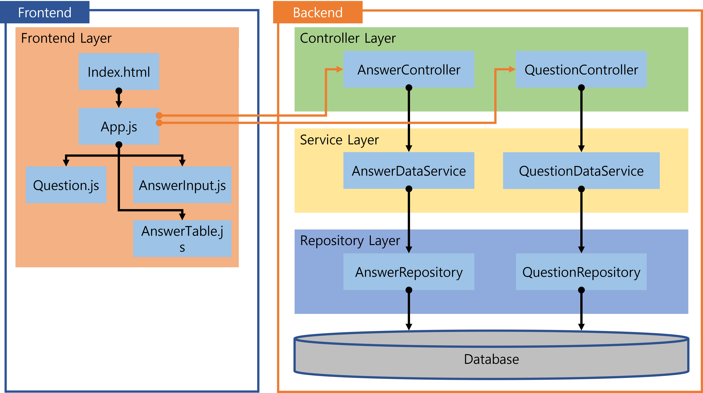

# Q&A a day web application
This project is a Q&A a day journal web application.

Answer the question every day on website.\
This is your journal of your life.

# Features
- Shows the today question
- Write your answer of a question
- Rewrite your answer written today
- Show answers which you are written
- Sort answers by year of writing
- Insert question from question.txt to Database when start server
# Snapshot


# Architecture


| Layer            | Description                                                  |
| ---------------- | ------------------------------------------------------------ |
| Frontend Layer   | This is the frontend written of the React. It shows the web page which user can read the quetions, answers and write answer of today question. It communicates to server via JSON. |
| Controller Layer | This layer controlles aceess and return data based on URL.   |
| Service Layer    | This layer contains the Entity and Business logic. In this layer, the request message was converted to the entity or the entity was converted to the response message. |
| Repository Layer | This layer contains the persistence logic via JPA.           |


# License
```
   Copyright 2021 Keonwoo Kim

   Licensed under the Apache License, Version 2.0 (the "License");
   you may not use this file except in compliance with the License.
   You may obtain a copy of the License at

       http://www.apache.org/licenses/LICENSE-2.0

   Unless required by applicable law or agreed to in writing, software
   distributed under the License is distributed on an "AS IS" BASIS,
   WITHOUT WARRANTIES OR CONDITIONS OF ANY KIND, either express or implied.
   See the License for the specific language governing permissions and
   limitations under the License.
```